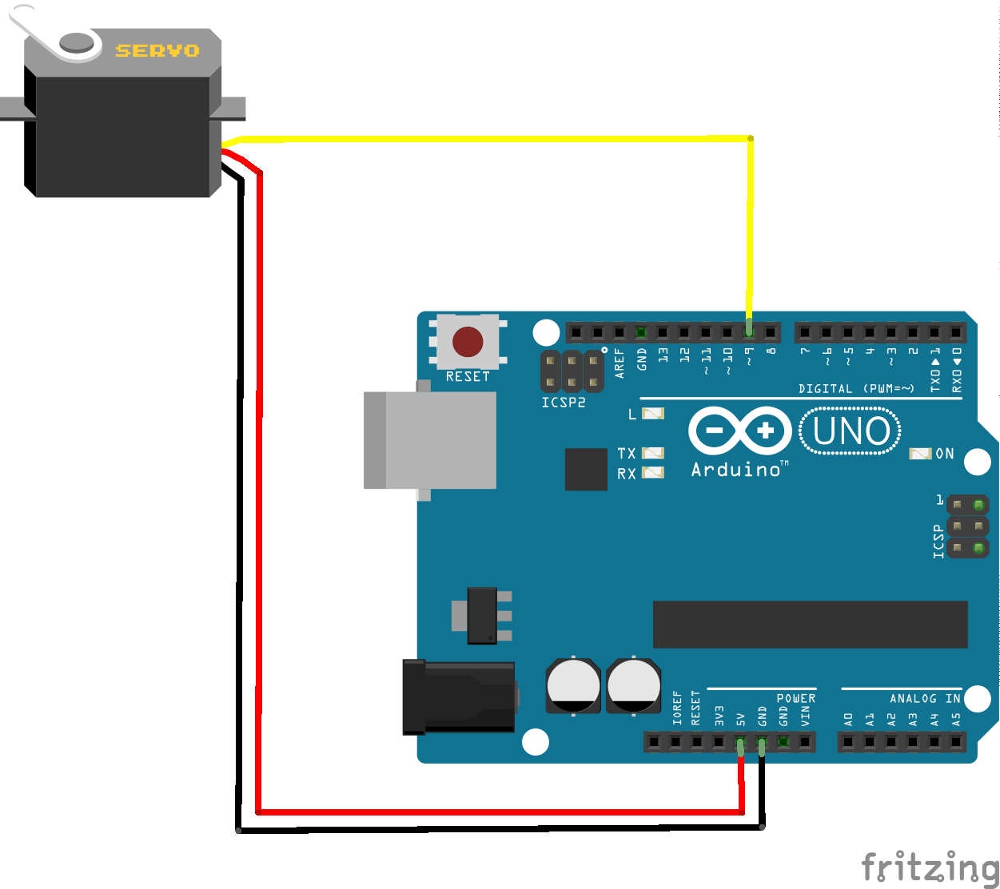
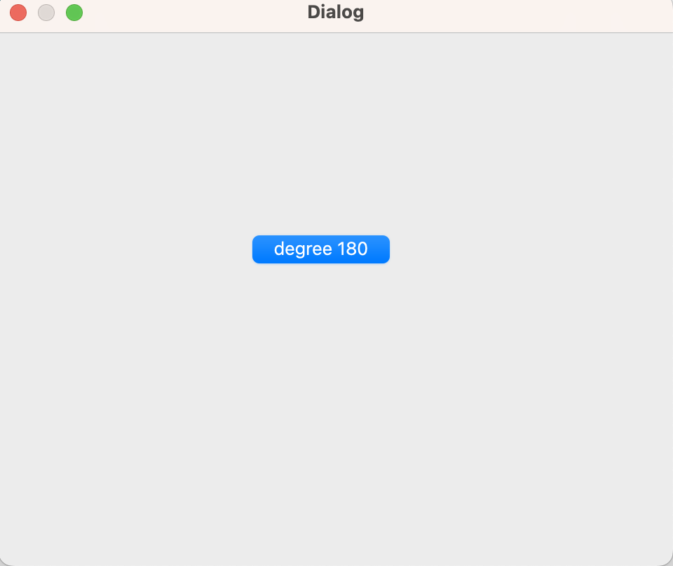

# Qt-Arduino-Serial-Com-
*I moved the servo motor connected to the arduino using serial ports with Qt Creator*  
*While doing this, you will have seen how I read and write over the serial port with qt*   

**Circuit Diagram** 
    

**SerialComServoCont.ino**  
*In this code content, we simply take the data coming from the serial port as the angle value of the servo motor.*  
 
**Servo_controller_Qt** 
  
*Connection: We use the QSerialPort class to communicate with Arduino via the serial port. We attempt to automatically find the appropriate port using the vendor and product IDs of the Arduino Uno. If it cannot be found, a warning message is displayed.

*Sending Commands: In the updateServo function, we send commands to the Arduino for the servo motor angle. In this function, we write the value in the servoSetting variable to the serial port.

*Reading Values: The readSensorValue function reads sensor data from Arduino. In this function, we transfer all data received from the serial port to a QByteArray variable and later convert it to a QString.
